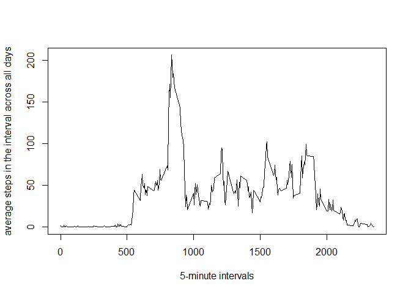

# Reproducible Research: Peer Assessment 1


## Loading and preprocessing the data

```r
Data<- read.csv("activity.csv", header = T)
head(Data)
```

```
##   steps       date interval
## 1    NA 2012-10-01        0
## 2    NA 2012-10-01        5
## 3    NA 2012-10-01       10
## 4    NA 2012-10-01       15
## 5    NA 2012-10-01       20
## 6    NA 2012-10-01       25
```
The next step is to process/transform the data set. Specifically date format. Secondly, I will also get rid of rows containing missing values and save the subset to a new data frame "data_sub". 

```r
Data$date<- as.Date(Data$date)
data_sub<- subset(Data,!is.na(Data$steps))
```

## What is mean total number of steps taken per day?
Here is total steps per day, and a histogram of the daily total number of steps


```r
dailysum <- tapply(data_sub$steps, data_sub$date, sum, na.rm=TRUE, simplify=T)
dailysum <- dailysum[!is.na(dailysum)]

hist(x=dailysum,
     col="red",
     breaks=20,
     xlab="Daily total steps",
     ylab="Frequency",
     main="The distribution of daily total (missing data ignored)")
```

\
Here is the mean and median of steps per day


```r
mean(dailysum)
```

```
## [1] 10766.19
```

```r
median(dailysum)
```

```
## [1] 10765
```


## What is the average daily activity pattern?

Make a time series plot (i.e. type = "l") of the 5-minute interval (x-axis) and the average number of steps taken, averaged across all days (y-axis)


```r
int_avg <- tapply(data_sub$steps, data_sub$interval, mean, na.rm=TRUE, simplify=T)
data_steps <- data.frame(interval=as.integer(names(int_avg)), avg=int_avg)

with(data_steps,
     plot(interval,
          avg,
          type="l",
          xlab="5-minute intervals",
          ylab="average steps in the interval across all days"))
```

\
Which 5-minute interval, on average across all the days in the dataset, contains the maximum number of steps?

```r
maxsteps <- max(data_steps$avg)
data_steps[data_steps$avg == maxsteps, ]
```

```
##     interval      avg
## 835      835 206.1698
```
## Imputing missing values
Calculate and report the total number of missing values in the dataset (i.e. the total number of rows with NAs)

```r
summary(is.na(Data$steps))
```

```
##    Mode   FALSE    TRUE    NA's 
## logical   15264    2304       0
```
There are 2304 NA in steps column

Filling in all of the missing values with mean for that interval
Create a new dataset that is equal to the original dataset but with the missing data filled in.

```r
Data_impute <- Data
Data_NAs <- is.na(Data_impute$steps)
int_avg <- tapply(data_sub$steps, data_sub$interval, mean, na.rm=TRUE, simplify=T)
Data_impute$steps[Data_NAs] <- int_avg[as.character(Data_impute$interval[Data_NAs])]
```
new histogram and new mean and new median


```r
new_dailysum <- tapply(Data_impute$steps, Data_impute$date, sum, na.rm=TRUE, simplify=T)

hist(x=new_dailysum,
     col="red",
     breaks=20,
     xlab="daily steps",
     ylab="frequency",
     main="The distribution of daily total (with missing data imputed)")
```

\

```r
mean(new_dailysum)
```

```
## [1] 10766.19
```

```r
median(new_dailysum)
```

```
## [1] 10766.19
```
The new mean is the same with original number 10766,but the new median is 10766, which is different from the original 10765. The median, after imputing for NAs becomes identical to the mean.

The impact of imputing missing data on the estimates of the total daily number of steps is that we will have higher counts in the histogram close to the mean.
## Are there differences in activity patterns between weekdays and weekends?

First I create a new factor variable "wk" with two values "weekday" and "weekend" 

```r
is_weekday <- function(d) {
    wd <- weekdays(d)
    ifelse (wd == "Saturday" | wd == "Sunday", "weekend", "weekday")
}

Data_impute$wk <- as.factor(sapply(Data_impute$date, is_weekday))
head(Data_impute)
```

```
##       steps       date interval      wk
## 1 1.7169811 2012-10-01        0 weekday
## 2 0.3396226 2012-10-01        5 weekday
## 3 0.1320755 2012-10-01       10 weekday
## 4 0.1509434 2012-10-01       15 weekday
## 5 0.0754717 2012-10-01       20 weekday
## 6 2.0943396 2012-10-01       25 weekday
```
Next is the panel plot

```r
wk_df <- aggregate(steps ~ wk+interval, data=Data_impute, FUN=mean)

library(lattice)
xyplot(steps ~ interval | factor(wk),
       layout = c(1, 2),
       xlab="Interval",
       ylab="Number of steps",
       type="l",
       lty=1,
       data=wk_df)
```

\
The weekend has overall higher activity level than weekday, and activity level is consistent through out the day, while on weekdays, the activity in the morning is high but it remains low for the rest of the day.
